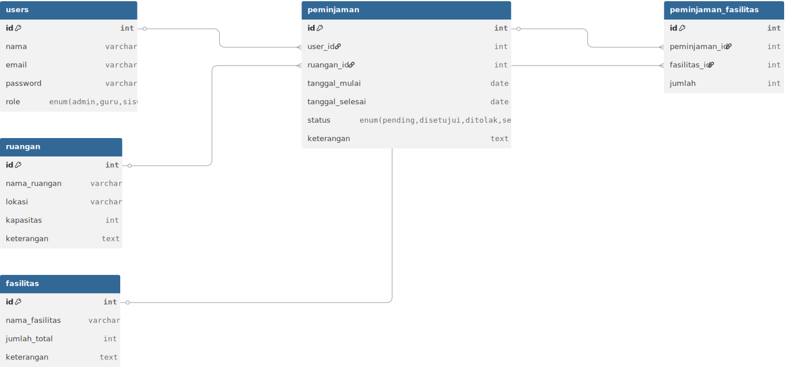

# 🏫 Web Peminjaman Ruangan & Fasilitas Sekolah

Sebuah aplikasi web untuk memudahkan proses peminjaman ruangan dan fasilitas oleh **Admin**, **Guru**, dan **Siswa**. Sistem ini dirancang agar efisien, transparan, dan mudah digunakan oleh seluruh civitas akademika.


---

## 🔧 Fitur Utama

### 👨‍💼 Admin
- Login sebagai admin
- Kelola data ruangan (tambah, edit, hapus)
- Kelola fasilitas (tambah, edit, hapus)
- Lihat, setujui, atau tolak pengajuan peminjaman
- Export laporan peminjaman
- Kelola jadwal dan ketersediaan ruangan
- (Opsional) Kelola data pengguna

### 👩‍🏫 Guru
- Login sebagai guru
- Ajukan peminjaman ruangan/fasilitas
- Lihat status pengajuan
- Batalkan pengajuan sebelum diverifikasi

### 👨‍🎓 Siswa
- Login sebagai siswa
- Ajukan peminjaman (akses terbatas)
- Lihat status peminjaman
- Batalkan pengajuan (jika belum disetujui)

---

## 🛠️ Teknologi yang Digunakan
- **Frontend**: HTML5, CSS3, JavaScript
- **Backend**: PHP (Native atau Framework sesuai kebutuhan)
- **Database**: MySQL
- **Library Tambahan**: DataTables, Bootstrap (jika digunakan)

---

## ⚙️ Instalasi Lokal

1. **Clone repositori ini:**
   ```bash
   git clone https://github.com/username/nama-repo.git

---

## 👾 Flowchart


## 👾 Flowchart


